# Agentic RAG チャットボット — システム仕様書

> バージョン: 0.1.0
> 作成日: 2026-02-22

---

## 目次

1. [概要](#1-概要)
2. [システムアーキテクチャ](#2-システムアーキテクチャ)
3. [バックエンド仕様](#3-バックエンド仕様)
4. [フロントエンド仕様](#4-フロントエンド仕様)
5. [データフロー](#5-データフロー)
6. [設定・環境変数](#6-設定環境変数)
7. [テスト戦略](#7-テスト戦略)
8. [サンプルデータ](#8-サンプルデータ)
9. [制限事項・今後の課題](#9-制限事項今後の課題)

---

## 1. 概要

### プロジェクトの目的と背景

本プロジェクトは、製品サポート業務を自動化するための **Agentic RAG チャットボット**である。従来の単純な FAQ 検索ではなく、LangGraph による ReAct エージェントループと RAG（Retrieval-Augmented Generation）を組み合わせることで、高品質かつ根拠に基づいた回答を自動生成する。

エージェントはユーザーの質問を分類・最適化し、ナレッジベースを検索して回答を生成する。情報が不足している場合は HITL（Human-in-the-Loop）機能によりユーザーへの確認を挟む仕組みを持つ。

### 主要機能の要約

| 機能 | 説明 |
|------|------|
| 製品サポート Q&A | 製品の操作方法・障害対応・契約料金に関する質問に回答 |
| RAG 検索 | ChromaDB によるベクトル類似検索でナレッジベースから根拠を取得 |
| クエリ最適化 | 代名詞解決・曖昧表現の具体化によるクエリリライト |
| 品質チェック | ハルシネーション評価・充足性評価による回答品質保証 |
| HITL 対話 | 曖昧な質問に対してボタン選択またはテキスト入力で確認を求める |
| SSE ストリーミング | Server-Sent Events によるリアルタイムトークン配信 |
| スレッド管理 | 会話スレッドの継続・MemorySaver による状態保持 |

### 技術スタック一覧

#### バックエンド

| カテゴリ | 技術 | バージョン |
|----------|------|-----------|
| Webフレームワーク | FastAPI | >=0.115.0 |
| ASGIサーバー | Uvicorn | >=0.32.0 |
| エージェントフレームワーク | LangGraph | >=0.2.0 |
| LLM ライブラリ | LangChain | >=0.3.0 |
| LLM プロバイダー | langchain-openai | >=0.3.0 |
| ベクトルDB | ChromaDB | >=0.5.0 |
| データバリデーション | Pydantic v2 | >=2.9.0 |
| 設定管理 | pydantic-settings | >=2.6.0 |
| テキスト分割 | langchain-text-splitters | >=0.3.0 |
| Python | Python | >=3.11 |

#### フロントエンド

| カテゴリ | 技術 | バージョン |
|----------|------|-----------|
| UI フレームワーク | React | ^19.2.0 |
| ビルドツール | Vite | ^7.3.1 |
| 言語 | TypeScript | ~5.9.3 |
| スタイリング | Tailwind CSS | ^4.2.0 |
| UI コンポーネント | Radix UI (scroll-area, slot) | 最新 |
| アイコン | lucide-react | ^0.575.0 |

---

## 2. システムアーキテクチャ

### 全体構成図

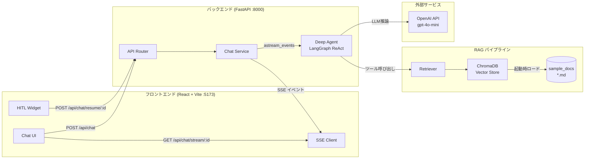

### レイヤー構成図

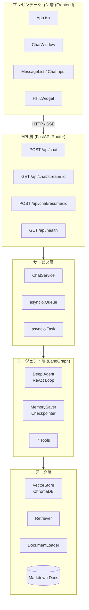

### ディレクトリ構成

```
agentic-rag-chatbot/
├── backend/
│   ├── app/
│   │   ├── main.py                  # FastAPI アプリ本体・ライフサイクル管理
│   │   ├── api/
│   │   │   ├── __init__.py          # ルーター集約
│   │   │   ├── chat.py              # チャット API エンドポイント
│   │   │   └── health.py            # ヘルスチェック
│   │   ├── agents/
│   │   │   ├── agent.py             # Deep Agent 構築・シングルトン管理
│   │   │   ├── prompts.py           # システムプロンプト定義
│   │   │   ├── state.py             # AgentState TypedDict
│   │   │   └── tools/
│   │   │       ├── __init__.py      # ツールのエクスポート
│   │   │       ├── classify.py      # クエリ分類ツール
│   │   │       ├── rewrite.py       # クエリリライトツール
│   │   │       ├── search.py        # ナレッジ検索ツール
│   │   │       ├── relevance.py     # 関連性評価ツール
│   │   │       ├── generate.py      # 回答生成ツール
│   │   │       ├── quality.py       # 品質チェックツール
│   │   │       └── ask_human.py     # HITL ツール
│   │   ├── config/
│   │   │   └── settings.py          # 設定管理 (pydantic-settings)
│   │   ├── models/
│   │   │   ├── chat.py              # ChatRequest / ChatStartResponse
│   │   │   ├── messages.py          # StreamEvent / StreamEventType
│   │   │   └── hitl.py              # HITLRequest / HITLResponse / ResumeRequest
│   │   ├── rag/
│   │   │   ├── vector_store.py      # ChromaDB ラッパー
│   │   │   ├── retriever.py         # ドキュメント検索関数
│   │   │   └── document_loader.py   # Markdown ローダー・チャンク分割
│   │   └── services/
│   │       └── chat_service.py      # ChatService・イベントキュー管理
│   ├── data/
│   │   ├── chroma_db/               # ChromaDB 永続化ディレクトリ
│   │   └── sample_docs/
│   │       ├── product_guide.md     # 操作方法 FAQドキュメント
│   │       ├── troubleshooting.md   # 障害・トラブル FAQドキュメント
│   │       └── contracts.md         # 契約・料金 FAQドキュメント
│   ├── tests/
│   │   ├── conftest.py
│   │   ├── test_api.py
│   │   ├── test_integration.py
│   │   ├── test_models.py
│   │   ├── test_rag.py
│   │   └── test_tools.py
│   └── pyproject.toml
└── frontend/
    ├── src/
    │   ├── App.tsx                  # ルートコンポーネント
    │   ├── components/
    │   │   ├── chat/
    │   │   │   ├── ChatWindow.tsx   # チャットメイン UI
    │   │   │   ├── MessageList.tsx  # メッセージ一覧
    │   │   │   ├── MessageBubble.tsx # 吹き出し
    │   │   │   ├── ChatInput.tsx    # テキスト入力
    │   │   │   └── TypingIndicator.tsx # タイピングアニメーション
    │   │   ├── hitl/
    │   │   │   ├── HITLWidget.tsx   # HITL コンテナ
    │   │   │   ├── ClarificationButtons.tsx # ボタン選択UI
    │   │   │   └── ClarificationInput.tsx   # テキスト入力UI
    │   │   └── ErrorBoundary.tsx    # エラーバウンダリ
    │   ├── hooks/
    │   │   ├── useChat.ts           # チャット状態管理フック
    │   │   └── useAutoScroll.ts     # 自動スクロールフック
    │   ├── lib/
    │   │   ├── api.ts               # REST API クライアント
    │   │   └── sse.ts               # SSE 接続管理
    │   └── types/
    │       ├── message.ts           # Message / ChatEvent / ChatStatus 型
    │       └── api.ts               # ApiResponse / ChatStartData 型
    ├── package.json
    └── vite.config.ts
```

---

## 3. バックエンド仕様

### 3.1 API エンドポイント

#### エンドポイント一覧

| メソッド | パス | 説明 |
|---------|------|------|
| GET | `/api/health` | ヘルスチェック |
| POST | `/api/chat` | チャット開始・メッセージ送信 |
| GET | `/api/chat/stream/{thread_id}` | SSE ストリーム接続 |
| POST | `/api/chat/resume/{thread_id}` | HITL 中断からの再開 |

#### GET /api/health

ヘルスチェック用エンドポイント。

**レスポンス例:**
```json
{
  "status": "ok",
  "version": "0.1.0"
}
```

#### POST /api/chat

新規チャットを開始、または既存スレッドにメッセージを送信する。

**リクエスト:**
```json
{
  "message": "製品Aの初期設定方法を教えてください",
  "thread_id": null
}
```

| フィールド | 型 | 必須 | 説明 |
|-----------|-----|------|------|
| `message` | string | 必須 | ユーザーメッセージ（1〜2000文字） |
| `thread_id` | string \| null | 任意 | 既存スレッドID。null の場合は新規作成 |

**レスポンス:**
```json
{
  "success": true,
  "data": {
    "thread_id": "550e8400-e29b-41d4-a716-446655440000",
    "status": "streaming"
  }
}
```

#### GET /api/chat/stream/{thread_id}

SSE（Server-Sent Events）ストリームを開始する。120秒間イベントがない場合は ping を送信し接続を維持する。

**レスポンスヘッダー:**
```
Content-Type: text/event-stream
Cache-Control: no-cache
Connection: keep-alive
X-Accel-Buffering: no
```

**イベントフォーマット:**
```
data: {"type":"token","content":"製品A"}\n\n
data: {"type":"tool_start","tool_name":"search_knowledge"}\n\n
data: {"type":"done"}\n\n
```

#### POST /api/chat/resume/{thread_id}

HITL によって中断されたエージェントを再開する。

**リクエスト:**
```json
{
  "request_id": "req-uuid",
  "response": "操作方法"
}
```

| フィールド | 型 | 必須 | 説明 |
|-----------|-----|------|------|
| `request_id` | string | 必須 | HITL リクエストID |
| `response` | string | 必須 | ユーザーの回答（1文字以上） |

**レスポンス:**
```json
{
  "success": true,
  "data": {
    "thread_id": "550e8400-e29b-41d4-a716-446655440000",
    "status": "streaming"
  }
}
```

#### API フロー図

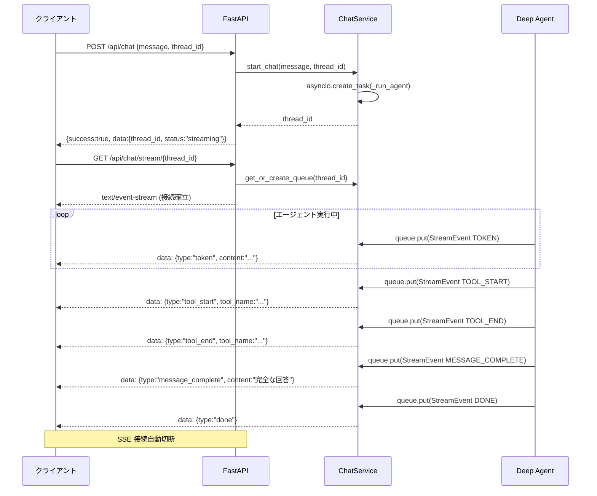

---

### 3.2 データモデル

#### Pydantic モデル一覧

**ChatRequest** (`app/models/chat.py`)

| フィールド | 型 | デフォルト | 説明 |
|-----------|-----|-----------|------|
| `message` | str | 必須 | ユーザーメッセージ (1〜2000文字) |
| `thread_id` | str \| None | None | 既存スレッドID |

**ChatStartResponse** (`app/models/chat.py`)

| フィールド | 型 | デフォルト | 説明 |
|-----------|-----|-----------|------|
| `thread_id` | str | 必須 | スレッドID |
| `status` | str | "streaming" | 現在のステータス |

**StreamEvent** (`app/models/messages.py`)

| フィールド | 型 | デフォルト | 説明 |
|-----------|-----|-----------|------|
| `type` | StreamEventType | 必須 | イベントタイプ |
| `content` | str \| None | None | テキストコンテンツ |
| `request_id` | str \| None | None | HITL リクエストID |
| `question` | str \| None | None | HITL 質問文 |
| `options` | list[str] \| None | None | HITL 選択肢リスト |
| `input_type` | str \| None | None | HITL 入力タイプ ("buttons" \| "text") |
| `tool_name` | str \| None | None | ツール名 |

**HITLRequest** (`app/models/hitl.py`)

| フィールド | 型 | デフォルト | 説明 |
|-----------|-----|-----------|------|
| `request_id` | str | 必須 | リクエストID |
| `question` | str | 必須 | ユーザーへの質問 |
| `options` | list[str] \| None | None | 選択肢（ボタン表示用） |
| `input_type` | str | "buttons" | 入力タイプ: buttons \| text |

**HITLResponse** (`app/models/hitl.py`)

| フィールド | 型 | デフォルト | 説明 |
|-----------|-----|-----------|------|
| `request_id` | str | 必須 | 対応するリクエストID |
| `response` | str | 必須 | ユーザーの回答（1文字以上） |

**ResumeRequest** (`app/models/hitl.py`)

| フィールド | 型 | デフォルト | 説明 |
|-----------|-----|-----------|------|
| `request_id` | str | 必須 | HITL リクエストID |
| `response` | str | 必須 | ユーザーの回答（1文字以上） |

#### StreamEventType 列挙値

| 値 | 説明 |
|----|------|
| `token` | LLM からのトークン（ストリーミング中） |
| `tool_start` | ツール実行開始 |
| `tool_end` | ツール実行終了 |
| `hitl_request` | HITL による中断・ユーザーへの確認要求 |
| `message_complete` | 完全な回答テキストの確定 |
| `error` | エラー発生 |
| `done` | エージェント処理完了 |

#### AgentState の状態フィールド

`AgentState` は LangGraph の `TypedDict` として定義される (`app/agents/state.py`)。

| フィールド | 型 | 説明 |
|-----------|-----|------|
| `messages` | Annotated[list[BaseMessage], add_messages] | 会話履歴（add_messages アノテーション付き） |
| `thread_id` | str | スレッドID |
| `query_category` | str | 分類されたクエリカテゴリ |
| `rewritten_query` | str | リライト後のクエリ |
| `search_results` | list[dict] | 検索結果リスト |
| `relevance_score` | float | 関連性スコア |
| `generated_answer` | str | 生成された回答 |
| `quality_check_passed` | bool | 品質チェック合否 |

---

### 3.3 Deep Agent

#### エージェントの構成

Deep Agent は `langgraph.prebuilt.create_react_agent` で構築された ReAct エージェントである。LLM モデルに `gpt-4o-mini`（temperature=0.1、streaming=True）を使用し、7 つのツールを持つ。状態は `MemorySaver` チェックポインタによりスレッド単位でインメモリ永続化される。

#### ReAct エージェントループ図

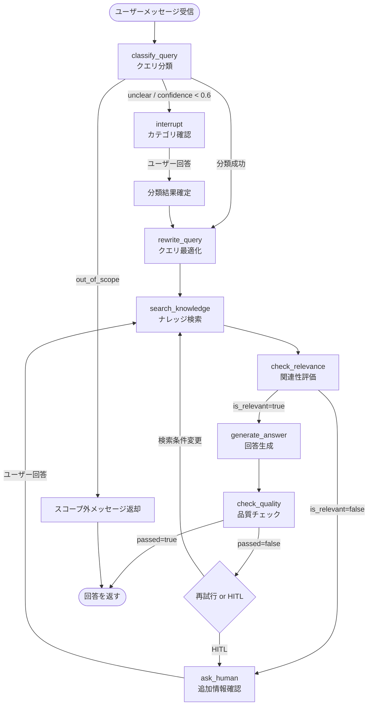

#### システムプロンプトの要約

`PRODUCT_SUPPORT_SYSTEM_PROMPT`（`app/agents/prompts.py`）は以下の内容を定義する。

- **役割**: 製品サポート AI アシスタント
- **対応カテゴリ**: 操作方法 / 障害・トラブル / 契約・料金 / その他
- **ワークフロー**: classify_query → rewrite_query → search_knowledge → check_relevance → generate_answer / ask_human → check_quality
- **重要ルール**: ナレッジベースの検索結果に基づいた回答のみ行う。範囲外（天気・ニュース等）には対応しない
- **回答フォーマット**: 簡潔・番号付きリスト・「ご不明な点がございましたら、お気軽にお問い合わせください。」で締める

#### ツール一覧

| ツール名 | 引数 | 戻り値 | 説明 |
|----------|------|--------|------|
| `classify_query` | `query: str` | `dict` (category, confidence, reason) | クエリをカテゴリに分類。unclear / confidence < 0.6 の場合は HITL で確認 |
| `rewrite_query` | `query: str`, `conversation_context: str = ""` | `str` | 検索最適化のためクエリをリライト（代名詞解決・曖昧表現の具体化） |
| `search_knowledge` | `query: str`, `category: str \| None = None`, `n_results: int = 5` | `list[dict]` | ChromaDB を検索して関連ドキュメントを返す |
| `check_relevance` | `query: str`, `search_results: list[dict]` | `dict` (is_relevant, score, relevant_doc_indices, reason) | 検索結果とクエリの関連性を LLM で評価 |
| `generate_answer` | `query: str`, `relevant_documents: list[dict]`, `category: str = ""` | `str` | 関連ドキュメントに基づいて回答を生成 |
| `check_quality` | `query: str`, `answer: str`, `source_documents: list[dict]` | `dict` (passed, hallucination_score, sufficiency_score, issues) | ハルシネーション（偽情報）と充足性を評価。両スコア 0.6 以上で合格 |
| `ask_human` | `question: str`, `options: list[str] \| None = None`, `input_type: str = "text"` | `str` | LangGraph `interrupt()` でエージェントを中断しユーザーに質問 |

#### ツール詳細仕様

**classify_query**
- LLM（temperature=0）でカテゴリを判定
- カテゴリ: 操作方法 / 障害・トラブル / 契約・料金 / その他 / out_of_scope / unclear
- `unclear` または confidence < 0.6 の場合: `interrupt()` でボタン形式の HITL を起動
- 戻り値: `{"category": str, "confidence": float, "reason": str}`

**rewrite_query**
- LLM（temperature=0）でクエリを最適化
- 規則: 代名詞の具体化・敬語除去・会話コンテキスト考慮
- リライト結果が 3 文字未満の場合は元のクエリをそのまま返す

**search_knowledge**
- `retrieve_documents()` を呼び出し ChromaDB を検索
- `category` 指定時は ChromaDB の `where` フィルタでカテゴリを絞り込む
- 結果が空の場合は「関連するドキュメントが見つかりませんでした。」を返す
- 各結果: `{content, metadata, relevance_score, id}` の形式

**check_relevance**
- LLM（temperature=0）で関連性を総合評価
- LLM パース失敗時: 検索スコアの平均値でフォールバック
- 戻り値: `{"is_relevant": bool, "score": float, "relevant_doc_indices": list, "reason": str}`

**generate_answer**
- LLM（temperature=0.3）で回答生成
- 参考情報に基づかない内容は「確認が必要です」と案内するよう指示
- カテゴリ情報もプロンプトに含める

**check_quality**
- LLM（temperature=0）で 2 軸評価
  - `hallucination_score`: ソースドキュメントへの根拠度（1.0 が最良）
  - `sufficiency_score`: 質問への回答充足度（1.0 が最良）
- 両スコアが 0.6 以上で `passed = True`
- パース失敗時: デフォルト値（0.7/0.7）で `passed = True` を返す

**ask_human**
- `options` 指定時は `input_type = "buttons"`（強制）
- `options` なし時は `input_type = "text"`（強制）
- `langgraph.types.interrupt()` でエージェントを中断し、`ChatService._handle_interrupt()` で SSE へ `HITL_REQUEST` イベントを送出

---

### 3.4 RAG パイプライン

#### RAG 処理フロー図

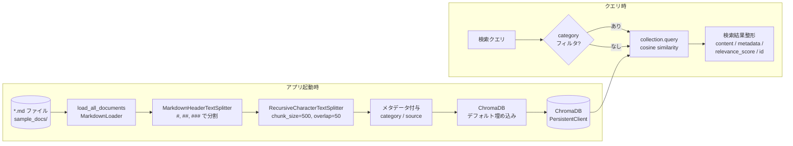

#### VectorStore の仕様

`VectorStore` クラス (`app/rag/vector_store.py`) は ChromaDB の `PersistentClient` をラップするシングルトンである。

| 項目 | 値 |
|------|-----|
| クライアント | `chromadb.PersistentClient` |
| 永続化ディレクトリ | `./data/chroma_db`（Settings で変更可能） |
| コレクション名 | `product_support`（Settings で変更可能） |
| 距離メトリクス | cosine (`hnsw:space: cosine`) |
| デフォルト埋め込みモデル | ChromaDB デフォルト（all-MiniLM-L6-v2） |

| メソッド | 引数 | 戻り値 | 説明 |
|---------|------|--------|------|
| `get_instance()` | なし | VectorStore | シングルトン取得 |
| `reset_instance()` | なし | None | インスタンスをリセット（テスト用） |
| `add_documents()` | documents, metadatas, ids | None | ドキュメントを追加 |
| `query()` | query_text, n_results, where | dict | 類似検索 |
| `count` (property) | なし | int | 格納済みドキュメント数 |

#### ドキュメントローダーの処理フロー

`load_all_documents()` (`app/rag/document_loader.py`) はアプリ起動時に `lifespan` イベントで呼び出される。

1. `data/sample_docs/*.md` を glob で列挙
2. 各ファイルを `load_markdown_file()` で処理
3. `MarkdownHeaderTextSplitter` でヘッダー（`#`, `##`, `###`）単位に分割
4. `RecursiveCharacterTextSplitter` でさらに細かく分割
5. メタデータを付与: `source`（ファイル名）、`category`（ファイル名から推定）
6. ドキュメント ID は `md5(source:content[:100])` で生成
7. `VectorStore.add_documents()` で一括格納
8. アプリ起動時にベクトルストアが空（`count == 0`）の場合のみロードする

#### チャンク分割パラメータ

| パラメータ | 値 | 説明 |
|-----------|-----|------|
| `chunk_size` | 500 | チャンクの最大文字数 |
| `chunk_overlap` | 50 | チャンク間のオーバーラップ文字数 |
| `separators` | `["\n\n", "\n", "。", "、", " "]` | 優先分割文字（順位あり） |

#### カテゴリ推定マッピング

| ファイル名（stem） | カテゴリ |
|-------------------|---------|
| `product_guide` | 操作方法 |
| `troubleshooting` | 障害・トラブル |
| `contracts` | 契約・料金 |
| その他 | その他 |

**検索結果の整形:**

`retrieve_documents()` (`app/rag/retriever.py`) は ChromaDB の生結果を以下の形式に整形する。

```python
{
    "content": str,           # ドキュメントテキスト
    "metadata": dict,         # ChromaDB メタデータ（category, source 等）
    "relevance_score": float, # 1.0 - distance (cosine なので 0〜1)
    "id": str,                # ドキュメントID
}
```

---

### 3.5 HITL (Human-in-the-Loop)

#### HITL フロー図

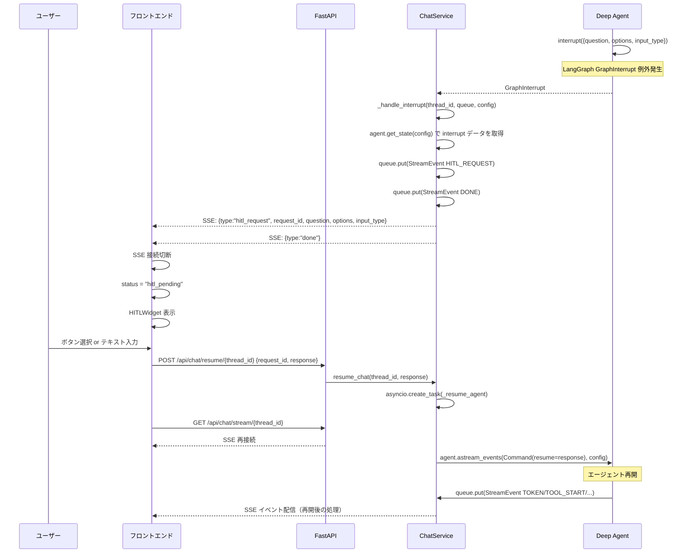

#### interrupt/resume メカニズムの説明

1. **interrupt 発生**: `ask_human` ツールまたは `classify_query` ツール内で `langgraph.types.interrupt(data: dict)` が呼び出される
2. **GraphInterrupt 例外**: LangGraph は `GraphInterrupt` 例外を発生させエージェント実行を中断する
3. **状態保存**: `MemorySaver` チェックポインタがその時点のエージェント状態を保存する
4. **interrupt データ取得**: `ChatService._handle_interrupt()` が `agent.get_state(config).tasks` を走査し `interrupt.value` から質問・選択肢を取得する
5. **SSE 通知**: `HITL_REQUEST` イベントをキューに入れ、フロントエンドに通知する
6. **resume**: フロントエンドから `POST /api/chat/resume` が届くと、`Command(resume=response)` を用いてエージェントを再開する

#### HITLリクエスト/レスポンスのデータフロー

| フェーズ | データ | 方向 |
|---------|--------|------|
| interrupt 発生時のデータ | `{question: str, options: list \| None, input_type: str}` | Agent → ChatService |
| SSE イベント | `StreamEvent(type=HITL_REQUEST, request_id, question, options, input_type)` | ChatService → Frontend |
| ユーザー回答（resume） | `ResumeRequest(request_id, response)` | Frontend → API |
| エージェント再開コマンド | `Command(resume=response_str)` | ChatService → Agent |

---

## 4. フロントエンド仕様

### 4.1 コンポーネント構成

#### コンポーネントツリー図

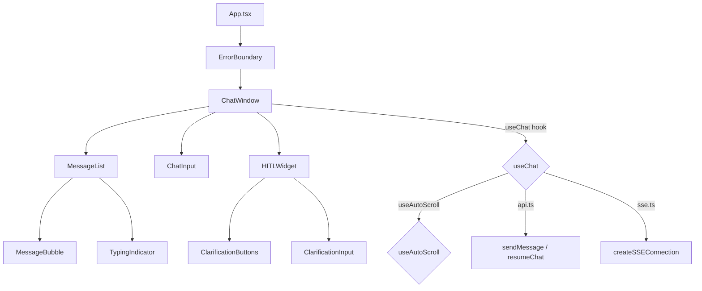

#### 各コンポーネントの Props 一覧

**App.tsx** - Props なし

**ErrorBoundary**

| Prop | 型 | 説明 |
|------|-----|------|
| `children` | ReactNode | 子コンポーネント |

**ChatWindow** - Props なし（`useChat` フックで状態取得）

**MessageList**

| Prop | 型 | 説明 |
|------|-----|------|
| `messages` | `readonly Message[]` | メッセージ一覧 |
| `streamingContent` | string | ストリーミング中の部分テキスト |
| `isStreaming` | boolean | ストリーミング中フラグ |

**MessageBubble**

| Prop | 型 | 説明 |
|------|-----|------|
| `message` | `Message` | 表示するメッセージ |

**ChatInput**

| Prop | 型 | 説明 |
|------|-----|------|
| `onSend` | `(message: string) => void` | 送信コールバック |
| `disabled` | boolean | 入力無効フラグ |

**TypingIndicator** - Props なし

**HITLWidget**

| Prop | 型 | 説明 |
|------|-----|------|
| `request` | `HITLRequest` | HITL リクエスト情報 |
| `onRespond` | `(response: string) => void` | 回答コールバック |
| `disabled` | boolean | 操作無効フラグ |

**ClarificationButtons**

| Prop | 型 | 説明 |
|------|-----|------|
| `options` | `readonly string[]` | 選択肢リスト |
| `onSelect` | `(option: string) => void` | 選択コールバック |
| `disabled` | boolean | ボタン無効フラグ |

**ClarificationInput**

| Prop | 型 | 説明 |
|------|-----|------|
| `onSubmit` | `(text: string) => void` | 送信コールバック |
| `disabled` | boolean | 入力無効フラグ |
| `placeholder` | string? | プレースホルダーテキスト |

---

### 4.2 状態管理

#### useChat フック

`useChat` フック (`src/hooks/useChat.ts`) がチャット機能の全状態を管理する。

**返却値インターフェース:**

| プロパティ | 型 | 説明 |
|-----------|-----|------|
| `messages` | `readonly Message[]` | 会話履歴（確定済みメッセージ） |
| `status` | `ChatStatus` | 現在の状態 |
| `streamingContent` | string | ストリーミング中の未確定テキスト |
| `currentHITL` | `HITLRequest \| null` | 現在の HITL リクエスト |
| `activeTool` | `string \| null` | 実行中ツール名 |
| `error` | `string \| null` | エラーメッセージ |
| `send` | `(message: string) => Promise<void>` | メッセージ送信関数 |
| `respondToHITL` | `(response: string) => Promise<void>` | HITL 回答関数 |

#### useChat 状態遷移図

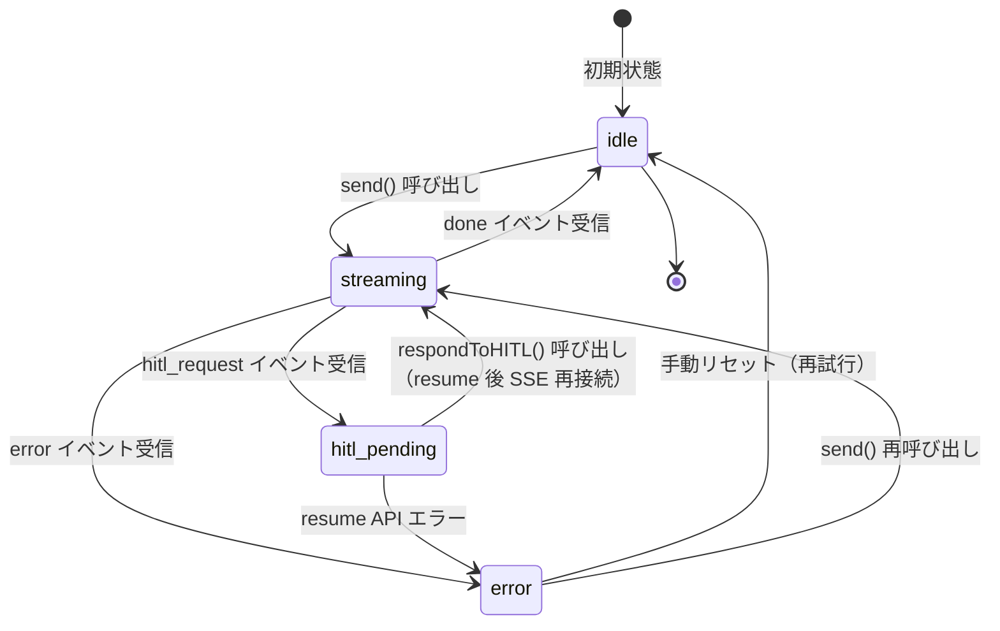

**各状態の説明:**

| 状態 | 説明 | UI の挙動 |
|------|------|----------|
| `idle` | 待機中 | チャット入力が有効 |
| `streaming` | エージェント処理中 | チャット入力が無効、TypingIndicator または streamingContent を表示 |
| `hitl_pending` | HITL 確認待ち | HITLWidget を表示、チャット入力が無効 |
| `error` | エラー発生 | エラーメッセージを表示 |

#### 内部 Ref の役割

| Ref | 型 | 目的 |
|-----|----|------|
| `threadIdRef` | `string \| null` | スレッド ID の保持（再レンダリングを避けるため） |
| `eventSourceRef` | `EventSource \| null` | SSE 接続インスタンスの保持 |
| `streamingContentRef` | `string` | ストリーミングテキスト（イベントハンドラ内での累積用） |
| `statusRef` | `ChatStatus` | 非同期コールバック内でのステータス参照用 |

---

### 4.3 SSE 通信

#### SSE イベントフロー図

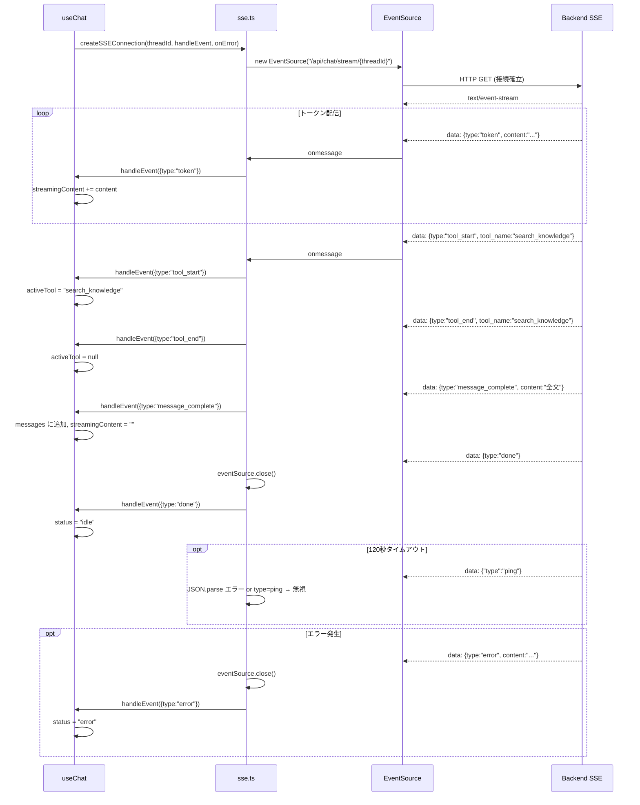

#### EventSource ライフサイクル

| イベント | 処理 |
|---------|------|
| `onmessage` | JSON パースして `handleEvent()` を呼び出す。`done` または `error` を受信したら `eventSource.close()` |
| `onerror` | `onError` コールバックを呼び出して `eventSource.close()` |
| ping 受信 | `type: "ping"` は `useChat` で無視する |
| HITL_REQUEST 受信 | `closeSSEConnection()` で明示的に接続を切断し、`status = "hitl_pending"` に遷移 |

**`closeSSEConnection()`:** `EventSource.readyState !== CLOSED` の場合のみ `close()` を呼び出す（二重切断を防止）。

---

### 4.4 HITL UI

#### HITL UI のフロー

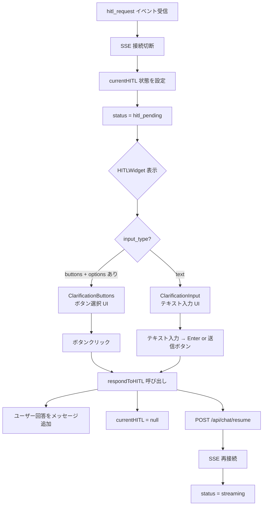

#### コンポーネントの切り替えロジック

`HITLWidget` は `request.input_type === 'buttons' && request.options` の条件で表示コンポーネントを切り替える。

| 条件 | 表示コンポーネント | 説明 |
|------|-----------------|------|
| `input_type === 'buttons'` かつ `options` が存在 | `ClarificationButtons` | 選択肢をボタンで表示（例: カテゴリ選択） |
| それ以外（`input_type === 'text'` または `options` なし） | `ClarificationInput` | フリーテキスト入力（例: 追加情報の入力） |

HITL カードはアンバー（amber）系のスタイルで装飾され「確認」バッジが表示される。

---

## 5. データフロー

### 正常系フロー

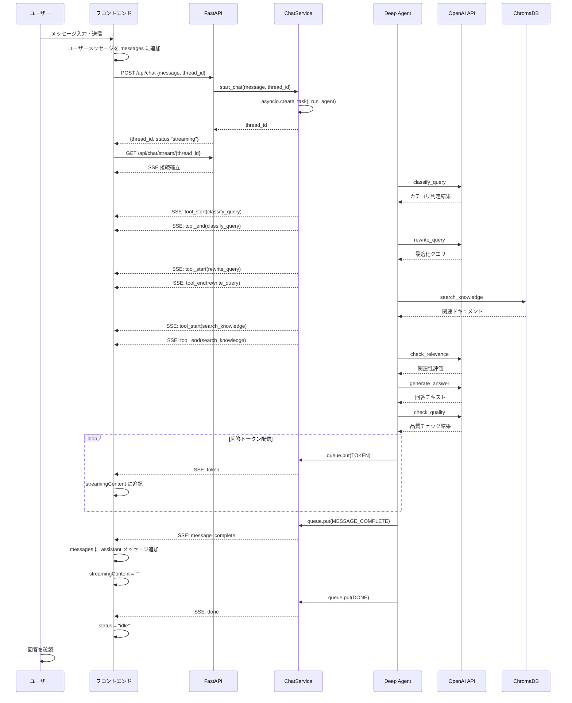

### HITL フロー

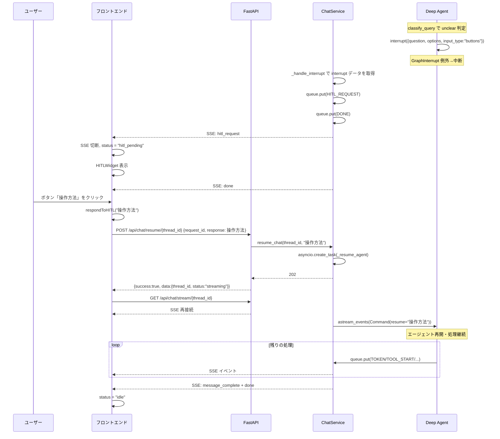

### エラーフロー

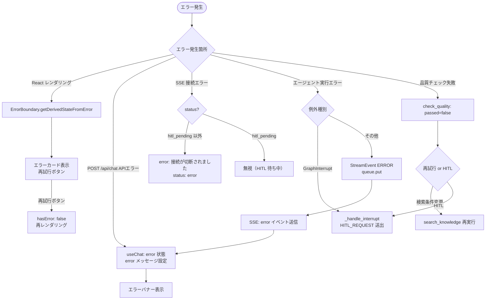

---

## 6. 設定・環境変数

### 環境変数一覧

| 環境変数 | 型 | デフォルト | 説明 |
|---------|-----|-----------|------|
| `OPENAI_API_KEY` | str | `""` | OpenAI API キー（必須） |
| `OPENAI_MODEL` | str | `"gpt-4o-mini"` | 使用する OpenAI モデル名 |
| `CORS_ORIGINS` | list[str] | `["http://localhost:5173", "http://localhost:3000"]` | CORS 許可オリジン一覧 |
| `CHROMA_PERSIST_DIR` | str | `"./data/chroma_db"` | ChromaDB 永続化ディレクトリパス |
| `CHROMA_COLLECTION_NAME` | str | `"product_support"` | ChromaDB コレクション名 |

### Settings クラスのフィールド定義

`Settings` クラス (`app/config/settings.py`) は `pydantic_settings.BaseSettings` を継承する。

```python
class Settings(BaseSettings):
    app_version: str = "0.1.0"
    openai_api_key: str = ""
    openai_model: str = "gpt-4o-mini"
    cors_origins: list[str] = ["http://localhost:5173", "http://localhost:3000"]
    chroma_persist_dir: str = "./data/chroma_db"
    chroma_collection_name: str = "product_support"

    model_config = {"env_file": ".env", "env_file_encoding": "utf-8"}
```

- `.env` ファイルまたは環境変数から設定を読み込む
- `@lru_cache` 付きの `get_settings()` 関数でシングルトンとして提供される

### Vite プロキシ設定

フロントエンド開発サーバー（`:5173`）は `/api` へのリクエストをバックエンド（`http://localhost:8000`）にプロキシする。

```typescript
// vite.config.ts
server: {
  proxy: {
    '/api': {
      target: 'http://localhost:8000',
      changeOrigin: true,
    },
  },
}
```

---

## 7. テスト戦略

### テストファイル一覧と対象

| ファイル | 行数 | テスト対象 |
|---------|------|-----------|
| `tests/conftest.py` | 13 | pytest フィクスチャ定義 |
| `tests/test_models.py` | 297 | Pydantic モデル（ChatRequest, StreamEvent, HITLRequest 等） |
| `tests/test_api.py` | 412 | API エンドポイント（`/api/health`, `/api/chat`, `/api/chat/stream`, `/api/chat/resume`） |
| `tests/test_tools.py` | 721 | 全 7 ツール（classify_query, rewrite_query, search_knowledge, check_relevance, generate_answer, check_quality, ask_human） |
| `tests/test_rag.py` | 343 | RAG パイプライン（VectorStore, DocumentLoader, Retriever） |
| `tests/test_integration.py` | 590 | エンドツーエンド統合テスト |

### テスト設定

| 項目 | 値 |
|------|----|
| テストフレームワーク | pytest >= 8.0.0 |
| 非同期サポート | pytest-asyncio >= 0.24.0（asyncio_mode = "auto"） |
| カバレッジ | pytest-cov >= 5.0.0 |
| HTTP クライアント | httpx >= 0.27.0 |
| テストディレクトリ | `tests/` |

### テストカバレッジ

目標カバレッジ: 80% 以上。

テスト合計行数: 約 2,376 行。

各レイヤーのテスト戦略:
- **モデルテスト**: バリデーションルール、フィールドのデフォルト値、enum 値の検証
- **APIテスト**: 正常系・異常系のレスポンス、SSE ストリームの挙動
- **ツールテスト**: LLM 呼び出しのモック、各ツールの入出力検証、HITL interrupt の動作
- **RAGテスト**: VectorStore のシングルトン、ドキュメントのロード・チャンク分割・検索
- **統合テスト**: フルフローのエンドツーエンド検証、HITL フローの再現

---

## 8. サンプルデータ

### 製品サポートFAQの構成

`data/sample_docs/` ディレクトリに 3 つの Markdown ファイルが格納されている。

| ファイル名 | カテゴリ | 行数 | 内容 |
|-----------|---------|------|------|
| `product_guide.md` | 操作方法 | 272 行 | 製品A・B・C の操作ガイド |
| `troubleshooting.md` | 障害・トラブル | 257 行 | ログイン問題・エラー対応 |
| `contracts.md` | 契約・料金 | 281 行 | プラン・料金・契約 FAQ |

### カテゴリ一覧

| カテゴリ名 | 対応ファイル | 内容例 |
|----------|-------------|-------|
| 操作方法 | `product_guide.md` | 初期設定手順・ログイン方法・機能説明 |
| 障害・トラブル | `troubleshooting.md` | パスワードリセット・アカウントロック解除・エラー対処 |
| 契約・料金 | `contracts.md` | ベーシック/スタンダード/エンタープライズプラン・解約手順 |
| その他 | （ファイル名が上記以外の場合） | 製品関連のその他の質問 |

### データ量の概要

| 指標 | 値 |
|------|----|
| ソースファイル数 | 3 ファイル |
| 総行数 | 約 810 行 |
| 想定チャンク数 | 数十〜百チャンク程度（chunk_size=500, overlap=50） |
| ChromaDB コレクション | `product_support` |

---

## 9. 制限事項・今後の課題

### 現時点の制限事項

| 項目 | 内容 |
|------|------|
| **インメモリ状態管理** | `MemorySaver` はプロセス再起動で会話履歴が消失する |
| **インメモリキュー** | `ChatService._queues` / `_tasks` はプロセスメモリに保持されるため、マルチプロセス・水平スケーリング不可 |
| **スレッドクリーンアップ** | 完了済みスレッドのキュー・タスクが自動削除されない（`cleanup()` メソッドは手動呼び出し） |
| **CORS** | デフォルトで `localhost:5173` と `localhost:3000` のみ許可 |
| **ドキュメントの重複ロード** | `store.count == 0` チェックのみ。ドキュメント更新時は手動で ChromaDB を削除する必要がある |
| **LLM 呼び出しの多さ** | 1 回の回答生成で最大 5〜6 回（classify, rewrite, relevance, generate, quality + HITL）LLM API を呼び出す |
| **エラーリカバリ** | 品質チェック失敗時の再試行ロジックはシステムプロンプトの指示に依存しており、実装上の制限がある |
| **シングルトン** | `VectorStore`, `ChatService`, `Deep Agent` はいずれもプロセスシングルトンのためテスト間の分離に注意が必要 |

### 拡張ポイント

| 項目 | 概要 |
|------|------|
| **永続化チェックポインタ** | `MemorySaver` を `PostgresSaver` / `RedisSaver` に置き換えることで会話履歴の永続化とスケールアウトが可能 |
| **Redis キュー** | `asyncio.Queue` を Redis Pub/Sub または Redis Streams に置き換えることで水平スケーリングに対応 |
| **埋め込みモデルのカスタマイズ** | `VectorStore` の埋め込み関数を `langchain_openai.OpenAIEmbeddings` に変更することで検索精度を向上 |
| **ドキュメント管理 API** | ドキュメントの追加・削除・更新を行う管理用 API エンドポイントの追加 |
| **セッション認証** | ユーザー識別・認証機能の追加（現在はすべて匿名スレッド） |
| **会話履歴の永続化** | データベースへの会話履歴の保存と検索 |
| **マルチモーダル対応** | 画像・PDF のアップロードとナレッジベースへの取り込み |
| **ストリーミング検索** | RAG 検索の段階的なストリーミング配信によるレイテンシ改善 |
| **エージェントグラフの可視化** | LangGraph Studio との連携によるデバッグ・モニタリング |
| **レート制限** | API エンドポイントへのレート制限とスロットリング機能の追加 |
